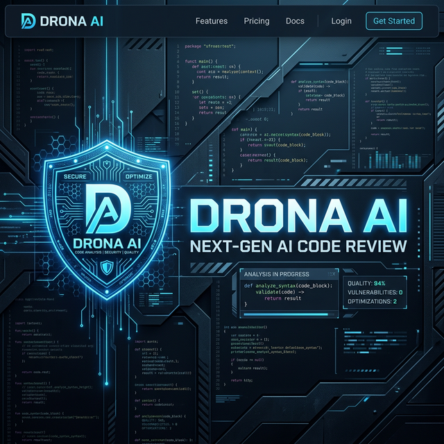
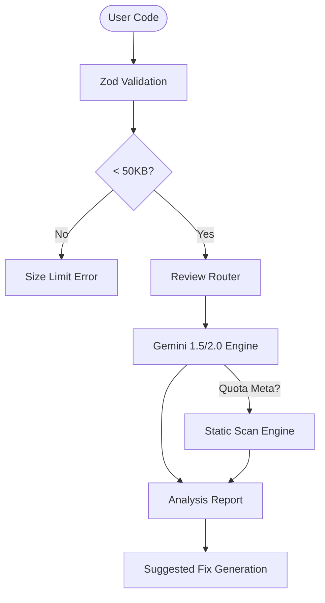

# 🛡️ DRONA AI

> **"Uncompromising AI Security Auditor for Next-Generation Codebases"**

DRONA is an advanced, edge-ready code review system that serves as a tireless Senior Security Auditor. Built with **Hono**, **React**, and **Google Gemini**, it performs deep static and semantic analysis to find vulnerabilities, optimize performance, and enforce architectural integrity.

[](https://hono.dev/)
[](https://react.dev/)
[](https://ai.google.dev/)
[](https://tailwindcss.com/)

---

## 🌟 Vision

Drona isn't just a linter; it's a **Review Agent**. Our goal is to bridge the gap between human expertise and automated checks by providing contextual, high-reasoning feedback that understands not just the *what*, but the *why* of your code.

## ✨ Key Features

### 🧠 Triple-Threat Analysis Engine
Drona intelligently routes your code through a three-tier analysis system:
1.  **Gemini 1.5/2.0 Pro**: High-reasoning semantic analysis for complex architectural patterns.
2.  **Gemini Flash**: Lightning-fast reviews for standard PR cycles.
3.  **Local Static Guard**: Hardened regex-based offline mode that triggers automatically if API quotas are met, ensuring zero downtime.

### ⚡ Magic Fix (Instant Remediation)
Found a bug? Don't leave the dashboard. Drona generates **Safe-to-Apply** code snippets directly in the UI. 
- One-click copy for secure alternatives (e.g., replacing `eval()` with `JSON.parse()`).
- Context-aware fixes for SQL Injection and performance bottlenecks.

### 🎨 Technical Brutalist Interface
A premium, focus-driven UI built for engineers:
- **Monaco Editor Integration**: Get the full power of VS Code's engine directly in your browser.
- **Real-time Threat Reporting**: Critical alerts are categorized and prioritized.
- **Design System Consistency**: Built with a custom "Brutalist" design language for maximum clarity.

### 🛡️ Hardened Security Audit
Detects high-risk patterns including:
- **RCE (Remote Code Execution)**: Deep scanning for insecure dynamic executions.
- **SQL Injection**: Detection of unparameterized queries.
- **Architectural Debt**: Identifies deep nesting and "spaghetti code" patterns.

---

## 🛠️ Technical Stack

### **Backend (Hono Edge)**
- **Ultra-fast Core**: Hono for sub-millisecond routing.
- **Schema Safety**: Zod validation for all incoming requests.
- **Security Headers**: Hardened with Hono secure headers and CORS.

### **Frontend (Vite + React)**
- **Modern State**: React 19 for seamless interactions.
- **Performance Styling**: Tailwind CSS v4 for zero-runtime overhead utility-first design.
- **Visuals**: Lucide React for consistent, high-quality iconography.

---

## 🚀 Installation & Setup

### **1. Prerequisites**
- **Node.js**: v20 or higher
- **API Key**: A Google Gemini API Key required for AI analysis.

### **2. Quick Start**
```bash
# Clone the repository
git clone https://github.com/berkaydgryl/DronaAI.git
cd DronaAI

# Install all dependencies (Root + Frontend)
npm install
npm run install:all # (if configured) or:
cd frontend && npm install && cd ..
```

### **3. Configuration**
Create a `.env` file in the root directory:
```env
GEMINI_API_KEY=your_gemini_api_key_here
```

### **4. Launch**
```bash
# Start Backend and Frontend concurrently
npm run dev:all
```
Your auditing station is now live at `http://localhost:5173`.

---

## 📐 Internal Workflow



---

## 🗺️ Future Vision (Roadmap)
- [ ] **Multi-file Audits**: Analyze entire directory structures.
- [ ] **GitHub Action**: Auto-review PRs directly on GitHub.
- [ ] **Custom Rules**: Define your own project-specific security standards.
- [ ] **Audit History**: Save and track security scores over time.

## 🤝 Contribution
Contributions are welcome! Please feel free to submit a Pull Request.

## 📄 License
Distributed under the MIT License. See `LICENSE` for more information.

---

<div align="center">
  <p>Built with ❤️ by <b>Berkay</b> & the Drona Cloud Unit</p>
  
</div>
